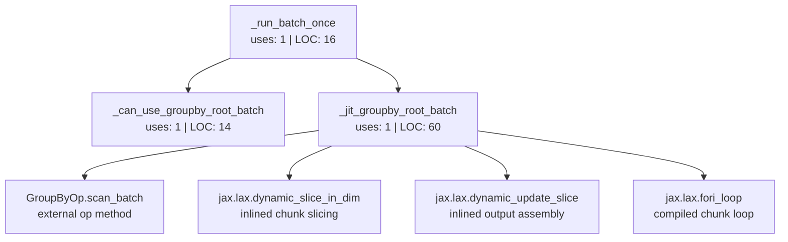

# jax_flat groupby-root batch dependency graph

This document maps the `jax_flat` groupby-root batch path in
`src/trading_dsl_engine/jax_flat/engine.py`. It is intended to render directly
on GitHub via Mermaid.

## Graph

Node labels include:

- **uses**: AST name/attribute references across tracked Python files in this
  repository, excluding the function definition itself.
- **LOC**: inclusive source lines from `def` through the end of the function
  body.

Small single-use helpers under 10 LOC were inlined into the caller; the graph
therefore only shows the remaining named functions in this path.

## Function metrics

| Function | Role | Uses | LOC | Defined at |
| --- | --- | ---: | ---: | --- |
| `_run_batch_once` | Validates batch inputs, initializes root-groupby state when needed, and dispatches eligible root `groupby` programs into the specialized JIT batch path. | 1 | 16 | `src/trading_dsl_engine/jax_flat/engine.py:146` |
| `_can_use_groupby_root_batch` | Checks whether the program shape supports the specialized root-groupby batch path. | 1 | 14 | `src/trading_dsl_engine/jax_flat/engine.py:208` |
| `_jit_groupby_root_batch` | Runs root-groupby batch execution under JIT, including inlined chunk slicing, `GroupByOp.scan_batch`, state carry, and output assembly. | 1 | 60 | `src/trading_dsl_engine/jax_flat/engine.py:228` |

## Inlined code

The previous small single-use helpers have been inlined into
`_jit_groupby_root_batch`:

| Former helper | Inlined responsibility |
| --- | --- |
| `_groupby_root_child_sequences` | Resolving root child input arrays. |
| `_run_groupby_root_batch` | Dispatching and state initialization now happen directly in `_run_batch_once`. |
| `_jit_groupby_root_batch_from_initial_state` | Initial state setup now happens directly before calling `_jit_groupby_root_batch`. |
| `_slice_time_chunk` | `jax.lax.dynamic_slice_in_dim` is called directly inside the chunk scanner. |
| `_empty_batch_like` | Output tree allocation is local to `_jit_groupby_root_batch`. |
| `_scan_groupby_root_chunk` | Chunk scanning is a local nested function inside `_jit_groupby_root_batch`. |
| `_run_groupby_root_chunk_loop` | The compiled chunk loop is now the body of `_jit_groupby_root_batch`. |
| `_jit_groupby_root_chunked_batch_from_initial_state` | Initial state setup now happens directly before calling `_jit_groupby_root_batch`. |
| `_jit_groupby_root_chunked_batch` | The chunked JIT path is now `_jit_groupby_root_batch`. |

## Notes

- The chunk loop remains under JAX JIT via `jax.lax.fori_loop`.
- The root-groupby path keeps chunked processing for large inputs while using the
  same compiled function for small and large batches.
