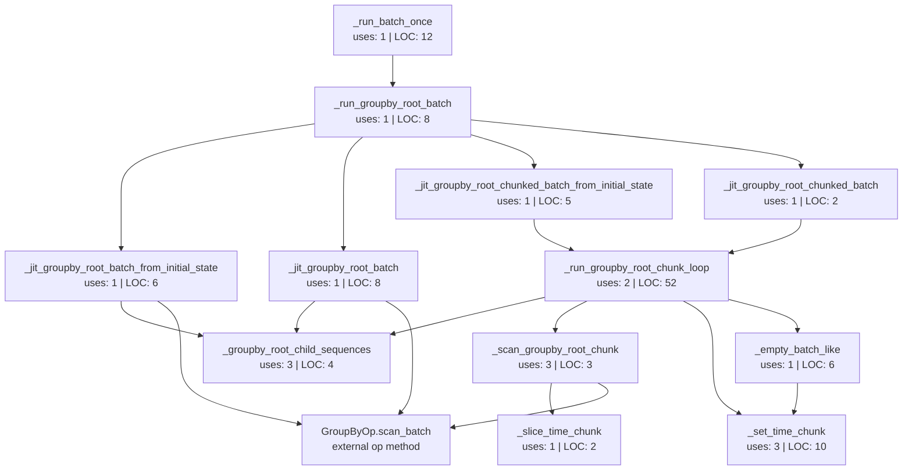

# jax_flat groupby-root batch dependency graph

This document maps the `jax_flat` groupby-root batch helpers in
`src/trading_dsl_engine/jax_flat/engine.py`. It is intended to render directly
on GitHub via Mermaid.

## Graph

Node labels include:

- **uses**: AST name/attribute references across tracked Python files in this
  repository, excluding the function definition itself.
- **LOC**: inclusive source lines from `def` through the end of the function
  body.

## Function metrics

| Function | Role | Uses | LOC | Defined at |
| --- | --- | ---: | ---: | --- |
| `_run_batch_once` | Dispatches eligible root `groupby` programs into the specialized root-batch path. | 1 | 12 | `src/trading_dsl_engine/jax_flat/engine.py:146` |
| `_groupby_root_child_sequences` | Maps root-child input nodes to their batch input arrays. | 3 | 4 | `src/trading_dsl_engine/jax_flat/engine.py:220` |
| `_run_groupby_root_batch` | Selects direct single-shot JIT for small batches or compiled chunked JIT for larger batches. | 1 | 8 | `src/trading_dsl_engine/jax_flat/engine.py:229` |
| `_jit_groupby_root_batch_from_initial_state` | Single-shot JIT path that initializes root groupby state. | 1 | 6 | `src/trading_dsl_engine/jax_flat/engine.py:240` |
| `_jit_groupby_root_batch` | Single-shot JIT path from caller-provided state. | 1 | 8 | `src/trading_dsl_engine/jax_flat/engine.py:249` |
| `_slice_time_chunk` | Uses JAX dynamic slicing to extract a time chunk inside compiled execution. | 1 | 2 | `src/trading_dsl_engine/jax_flat/engine.py:259` |
| `_set_time_chunk` | Uses JAX dynamic update slicing to write a chunk result into the batch output tree. | 3 | 10 | `src/trading_dsl_engine/jax_flat/engine.py:263` |
| `_empty_batch_like` | Allocates an output tree matching a sample chunk output over the full time length. | 1 | 6 | `src/trading_dsl_engine/jax_flat/engine.py:275` |
| `_scan_groupby_root_chunk` | Runs `GroupByOp.scan_batch` for one chunk. | 3 | 3 | `src/trading_dsl_engine/jax_flat/engine.py:283` |
| `_run_groupby_root_chunk_loop` | Holds the compiled chunk loop, carries group state, and assembles chunk outputs. | 2 | 52 | `src/trading_dsl_engine/jax_flat/engine.py:288` |
| `_jit_groupby_root_chunked_batch_from_initial_state` | JIT wrapper for the chunked path that initializes groupby state. | 1 | 5 | `src/trading_dsl_engine/jax_flat/engine.py:343` |
| `_jit_groupby_root_chunked_batch` | JIT wrapper for the chunked path from caller-provided state. | 1 | 2 | `src/trading_dsl_engine/jax_flat/engine.py:351` |

## Notes

- The chunking policy remains outside the compiled region because it depends on
  the static batch length and selects between the single-shot and chunked paths.
- For the chunked path, all per-chunk scanning, state carry, and output assembly
  happen inside the jitted function through `jax.lax.fori_loop` and
  `jax.lax.dynamic_update_slice`.
